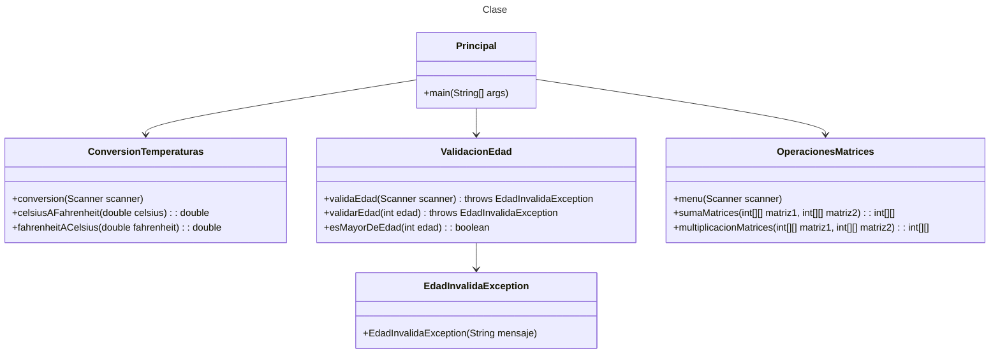

# Proyecto - Ejercicio Manejo de Excepciones

## Ejercicio: Conversión de Temperaturas con Manejo de Excepciones

Crea un programa que convierta temperaturas de Celsius a Fahrenheit y viceversa. El programa debe manejar las siguientes excepciones:

- NumberFormatException: cuando se ingresan valores no numéricos.
- IllegalArgumentException: cuando se ingresa una opción no válida.
- Exception: para cualquier otra excepción no prevista.

Requisitos:

Solicita al usuario que ingrese una temperatura.

Solicita al usuario que elija la conversión: de Celsius a Fahrenheit o de Fahrenheit a Celsius.

Realiza la conversión y muestra el resultado.

Maneja las excepciones mencionadas y muestra un mensaje de error adecuado:**"Entrada no válida. Por favor, ingrese un número."**, en el caso de **NumberFormatException**


## Ejercicio: Validación de Edad con Excepciones Personalizadas

Crea un programa que valide la edad ingresada por el usuario. Si la edad es menor a 0 o mayor a 150, lanza una excepción personalizada llamada EdadInvalidaException.

Requisitos:

Solicita al usuario que ingrese su edad.

Si la edad es válida (entre 0 y 150), muestra un mensaje indicando que la edad es válida.

Si la edad es inválida, lanza una excepción personalizada EdadInvalidaException y muestra un mensaje de error adecuado.

## Operaciones con Matrices

Este programa permite realizar operaciones básicas con matrices, como la suma y la multiplicación de matrices.

El usuario puede ingresar los elementos de las matrices y el programa realizará la operación seleccionada, mostrando el resultado en la consola.

### Funcionalidades

1. **Suma de Matrices**
   - Permite sumar dos matrices de las mismas dimensiones.
   - El usuario debe ingresar el número de filas y columnas de las matrices.
   - El usuario ingresa los elementos de las dos matrices.
   - El programa calcula y muestra la matriz resultante de la suma.

2. **Multiplicación de Matrices**
   - Permite multiplicar dos matrices.
   - El usuario debe ingresar el número de filas de la primera matriz, el número de columnas de la primera matriz (que es igual al número de filas de la segunda matriz) y el número de columnas de la segunda matriz.
   - El usuario ingresa los elementos de las dos matrices.
   - El programa calcula y muestra la matriz resultante de la multiplicación.

### Uso

1. Ejecuta el programa.
2. Selecciona una opción del menú:
   - `1` para sumar matrices.
   - `2` para multiplicar matrices.
   - `3` para salir del programa.
3. Sigue las instrucciones para ingresar las dimensiones y los elementos de las matrices.
4. El programa mostrará el resultado de la operación seleccionada.


## Diagrama de clases

[Editor en línea](https://mermaid.live/)

[Referencia-Mermaid](https://mermaid.js.org/syntax/classDiagram.html)

## Diagrama de clases UML con draw.io
El repositorio está configurado para crear Diagramas de clases UML con ```draw.io```. Para usarlo simplemente agrega un archivo con extensión ```.drawio.png```, das doble clic sobre el mismo y se activará el editor ```draw.io``` incrustado en ```VSCode``` para edición. Asegúrate de agregar las formas UML en el menú de formas del lado izquierdo (opción ```+Más formas```).

## Uso del proyecto con make

### Default - Compilar+Probar+Ejecutar
```
make
```
### Compilar
```
make compile
```
### Probar todo
```
make test
```
### Ejecutar App
```
make run
```
### Limpiar binarios
```
make clean
```
## Comandos Git-Cambios y envío a Autograding

### Por cada cambio importante que haga, actualice su historia usando los comandos:
```
git add .
git commit -m "Descripción del cambio"
```
### Envíe sus actualizaciones a GitHub para Autograding con el comando:
```
git push origin main
```
## Comandos individuales
### Compilar

```
find ./ -type f -name "*.java" > compfiles.txt
javac -d build -cp lib/junit-platform-console-standalone-1.5.2.jar @compfiles.txt
```
Ejecutar ambos comandos en 1 sólo paso:

```
find ./ -type f -name "*.java" > compfiles.txt ; javac -d build -cp lib/junit-platform-console-standalone-1.5.2.jar @compfiles.txt
```


### Ejecutar Todas la pruebas locales de 1 Test Case

```
java -jar lib/junit-platform-console-standalone-1.5.2.jar -class-path build --select-class miTest.AppTest
```
### Ejecutar 1 prueba local de 1 Test Case

```
java -jar lib/junit-platform-console-standalone-1.5.2.jar -class-path build --select-method miTest.AppTest#appHasAGreeting
```
### Ejecutar App
```
java -cp build miPrincipal.Principal
```
Los comandos anteriores están considerados para un ambiente Linux. [Referencia.](https://www.baeldung.com/junit-run-from-command-line)
